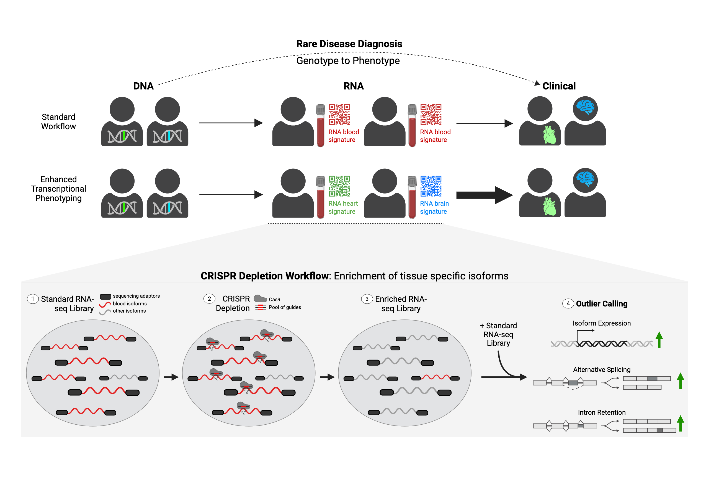

# Rare_Disease_Depletion

Improving the diagnostic capability of RNA-seq for rare disease.

<p align="center">
  
</p>

---

## Summary

We developed an isoform-aware CRISPR-Cas9 depletion workflow for whole-blood RNA-seq that removes highly abundant blood-dominant transcript regions from constructed libraries, redirecting sequencing depth toward low-abundance, disease-relevant isoforms. In rare disease samples, this improved detection of expression and splicing abnormalities, enhanced recovery of non-blood-enriched transcript signals, and provided a practical, clinically compatible way to increase the diagnostic and biological value of whole-blood RNA-seq.

---

## Overview

This repository contains code used to generate results, analyze data, and reproduce figures for the rare disease depletion workflow.

The project includes:

- CRISPR guide design
- transcriptome-wide differential isoform analysis
- tissue enrichment analysis
- single-sample outlier detection
- shared outlier analysis across sample pairs
- splicing visualization resources
- supplementary figure generation

---

## Processing workflow

All 96 standard RNA-seq samples and all 96 depleted RNA-seq samples were processed using the following pipeline:

- [MoTrPAC RNA-seq pipeline](https://github.com/MoTrPAC/motrpac-rna-seq-pipeline/tree/master)
- Reads were aligned with **STAR**
- **GENCODE v48** was used as the reference annotation
- **RSEM** counts and TPM values for each sample were used for downstream analyses

---

## Repository structure

### `Scripts/`
General scripts and commands used throughout the project, including:

- FlashFry commands to generate initial guide sequences
- R scripts for differential isoform expression and differential transcript usage
- LeafCutter commands for splicing and outlier detection
- plotting scripts for sashimi plots

### `CRISPR_guide_design/`
Files and notebooks related to design of the depletion panel, including:

- BED files of targeted contigs
- BED files of preserved contigs
- Python functions for guide selection
- notebook used to generate **Figure 1**
- guide selection logic and design workflow

### `Global_Effect_Transcriptome/`
Analyses of transcriptome-wide effects of depletion, including:

- notebook for **Figure 2** using DESeq2 results
- notebook for **Figure 2** differential transcript usage analysis
- notebook for **Figure 2** LeafCutter differential splicing analysis

### `Tissue_Enrichment/`
Code for evaluating tissue-specific effects of depletion, including:

- Python functions to calculate tissue enrichment
- notebook used to generate **Figure 3**

### `Sample_Outliers/`
Single-sample outlier analyses, including:

- Python functions for expression and splicing outlier detection
- notebook for **Figure 4** expression outliers
- notebook for **Figure 4** splicing outliers

### `LeafViz/`
Files for interactive splicing visualization, including:

- `leafviz_results.RData` for exploring depletion-associated splicing changes relative to standard RNA-seq

### `Shared_Outliers/`
Analyses of outliers shared across sample pairs, including:

- Python functions for calculating shared outliers
- notebook for **Figure 5**
- analysis of **RNU4-2** top isoform expression outliers

### `Supplementary/`
Notebooks and code used to reproduce all supplementary figures.

---

## Visualizing differential splice junction usage with LeafViz

This repository includes resources for interactive visualization of depletion-associated splicing changes using **LeafViz**.

### To visualize intron cluster changes for each gene

1. Use the prepared `leafviz_results.RData` file in the `LeafViz/` directory
2. Install **LeafViz** locally
3. Launch the Shiny app locally

### Install LeafViz

In R:

```r
install.packages("remotes")
remotes::install_github("jackhump/leafviz")
```

On the command line:

```bash
git clone https://github.com/jackhump/leafviz.git
```

### Run the Shiny app locally

```bash
R -q -e "library(leafviz); options(shiny.host='127.0.0.1', shiny.port=8787, shiny.launch.browser=TRUE); leafviz::leafviz('leafviz_results.RData')"
```

Then open:

```text
http://localhost:8787
```

### LeafViz result preparation

LeafViz results were prepared following the [LeafViz tutorial](https://github.com/jackhump/leafviz).

Preparation steps:

1. **GENCODE v48** annotation was processed using `gtf2leafcutter.pl`
2. Results were prepared using `prepare_results.R` with:
   - metadata describing the 96 standard and 96 depleted samples
   - `_perind_numers.counts.gz`
   - `_cluster_significance.txt`
   - `_effect_sizes.txt`
   - `gencode_v48`

---

## FRASER analysis

FRASER analysis was run using the pipeline documented here:

- [Transcriptome Wide Splicing Analysis](https://github.com/maurermaggie/Transcriptome_Wide_Splicing_Analysis/tree/main)

---

## Notes

This repository is intended to support reproduction of the analyses and figures associated with the rare disease depletion workflow. Individual directories are organized by analysis module and figure.

